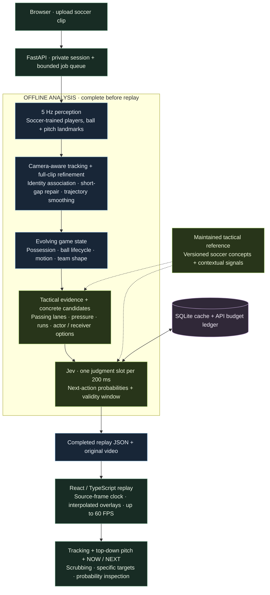

# PitchState

### See the game beneath the game.

Upload a soccer clip. Replay the players, the ball, the tactical picture, and **who might do what next** — all on one synchronized timeline.

[Watch the demo](#demo) · [System architecture](#system-architecture) · [Run locally](#run) · [Validation](docs/VALIDATION.md)

## Demo

https://github.com/user-attachments/assets/8cfa273a-fa0a-43c9-88aa-8f9407f17304

**[Watch the processed 60 FPS video ↗](https://github.com/KennyMx/PitchState/raw/refs/heads/main/docs/assets/pitchstate-demo.mp4)** · 12 seconds · 60 FPS replay · 5 Hz analysis

This presentation replay is rendered from real footage and the pipeline's saved analysis, rather than a screen recording of the app. The embedded video renders interpolated tracking overlays at 60 FPS over the original 25 FPS footage (repeated source frames, not native 60 FPS camera motion). IDs identify tracks, not recognized jersey numbers. [Footage credit and reproduction](docs/assets/README.md).

| See what is happening                                                   | Understand the situation                                                        | Explore what comes next                                                                         |
| ----------------------------------------------------------------------- | ------------------------------------------------------------------------------- | ----------------------------------------------------------------------------------------------- |
| Player and ball tracks, trajectories, and a moving pitch reconstruction | Possession, ball release and reception, pressure, passing lanes, and team shape | Player-specific choices such as **#25 → #15 pass**, with probabilities that update every 200 ms |

## System architecture

**Process the whole clip first. Replay the completed analysis smoothly.** Full-video context helps stabilize tracks and trajectories; the original video's frame clock drives playback independently of the analysis frequency.



- **Local perception:** three soccer models run in the Python service. Jev receives compact state and candidate descriptions; raw footage stays out of its requests.
- **State-aware decisions:** controlled possession, release, transit, and reception produce different candidate actions. Expiry and control-state changes prevent stale pass predictions from surviving a release.
- **Bounded running costs:** persistent inference/Jev caches, durable request reservations, upload limits, and a single processing worker keep spending explicit.

Read the [detailed architecture](docs/ARCHITECTURE.md), [Jev integration](docs/JEV.md), and [maintained tactical reference](docs/TACTICAL_REFERENCE.md). The default upload path uses neural perception; a labeled simulation and an earlier browser baseline remain available for comparison.

## Run

Use Node 22 and Python 3.10+. The tested environment is macOS with Apple MPS; CUDA and CPU are also selectable. Model downloads total approximately 414 MB; Python/Torch needs additional disk space.

```sh
npm ci
bash scripts/setup_backend.sh
cp .env.example .env.local
# Set JEV_API_KEY in .env.local. Never use a VITE_* variable for secrets.
npm run server
```

In another terminal:

```sh
npm run dev
```

Open http://127.0.0.1:5173. Upload an MP4/WebM/MOV (up to 60 seconds, 100 MB, 4K). Team A is initially the darker jersey cluster; choose its attack direction before processing. The entire clip is processed before replay opens. Offline refinement stabilizes identities and fills short, explicitly labeled gaps. Video-frame callbacks synchronize interpolated overlays at the source cadence, including 60 FPS sources. Play, scrub, select tracks, inspect movement, and click Jev timestamps or tactical moments. Export the complete replay JSON for inspection.

Without a Jev key, perception and tactical state still work; the interface reports unavailable judgments instead of fabricating probabilities.

## Reproduce the real-footage evaluation

The downloader references public links from [Roboflow's soccer example](https://github.com/roboflow/sports/tree/main/examples/soccer). Full evaluation clips are downloaded separately; the short README analysis excerpt is credited in [demo notes](docs/assets/README.md). Source footage rights remain with their owners.

```sh
.venv/bin/python scripts/download_assets.py --footage
PYTHONPATH=. .venv/bin/python scripts/analyze_clip.py data/2e57b9_0.mp4 \
  --seconds 12 --jev --output .local/real-analysis.json
```

Reload the application to open the real cached example. A second clip is available as `data/0bfacc_0.mp4`. `--jev` makes actual paid requests within the configured caps; omit it for perception/state evaluation. Repeated identical state requests use the persistent cache.

| Real evaluation             | Samples | Observed ball coverage | Processing time |
| --------------------------- | ------: | ---------------------: | --------------: |
| First clip, 12 seconds, CPU |      60 |                  86.7% |         108.1 s |
| Second clip, 8 seconds, MPS |      40 |                  92.5% |          28.4 s |

Coverage measures availability, **not accuracy**. These are development runs on different clips/devices, not a controlled hardware comparison. Both produced actual Jev distributions. See [validation](docs/VALIDATION.md) and [machine-readable reports](reports/real-footage-baseline.json).

## What is implemented

- Soccer-trained player, goalkeeper, referee, ball and pitch-landmark models; tiled small-ball reacquisition.
- Camera motion compensation, two-stage track association, ball filtering, bounded prediction, and shot resets.
- Learned pitch calibration with RANSAC and rejection checks; explicit camera-space fallback.
- Possession hysteresis, movement estimates, visible team shape, pressure, passing options, local overloads, dangerous-run candidates and transition evidence.
- Context-grounded Jev questions with complete next-action distributions, timestamps, abstention and stale-judgment indicators.
- Offline multi-stage jobs, cancellation, private session ownership, persistent caches, durable API budget, daily upload cap and replay export.

This is an operational research project, not a validated professional tracking system. Ball occlusion, airborne-ball projection, crowded scenes, similar kits, unusual camera angles and partial-field views remain hard. IDs are track IDs, not player identities. Speed/distance and tactical labels inherit perception errors. Jev probabilities have not been calibrated against labeled match outcomes.

## Engineering and deployment

Read [architecture](docs/ARCHITECTURE.md), [Jev integration](docs/JEV.md), [validation](docs/VALIDATION.md), and [deployment](docs/DEPLOYMENT.md).

```sh
npm test
npm run build
npm run format:check
pip install -r server/requirements-test.txt  # inside the backend environment
npm run test:server
.venv/bin/ruff check server scripts
```

A static-only deployment can run the browser baseline, but **neural uploads require the Python service**. The included single-worker container setup bounds cost and serves the frontend/API together. No public deployment is claimed. Model/runtime license obligations and footage rights must be resolved for the intended deployment; see `models/manifest.json`.

The maintained [tactical reference](docs/TACTICAL_REFERENCE.md) is loaded into Jev requests, with a version/hash for reproducibility. See [offline evaluation](reports/offline-evaluation.json) and [crossing sensitivity](reports/action-context-sensitivity.json). Reconstruction uses future observations; the displayed forecasts are retrospective judgments, not a leakage-free prospective benchmark.

## Level 2: who does what next?

Analysis now evaluates Jev at each 200 ms sample. The video separates **NOW** (controlled ball, release, transit, reception or contested control) from **NEXT** (for example, “#4 → #2 pass” or “#10 receives”). The probability panel compares concrete alternatives and a dashed route highlights the leading visible target. Predictions expire at the next sample and immediately on a control-state change. The system does not continue forecasting a pass by a player who has already released the ball. IDs are tracks, not recognized jersey numbers.

Motion over several samples stabilizes possible reception paths; single-step motion keeps control detection responsive. This remains a geometric estimate: the system cannot directly measure airborne ball height, and recipient accuracy has not been established against ground truth.
