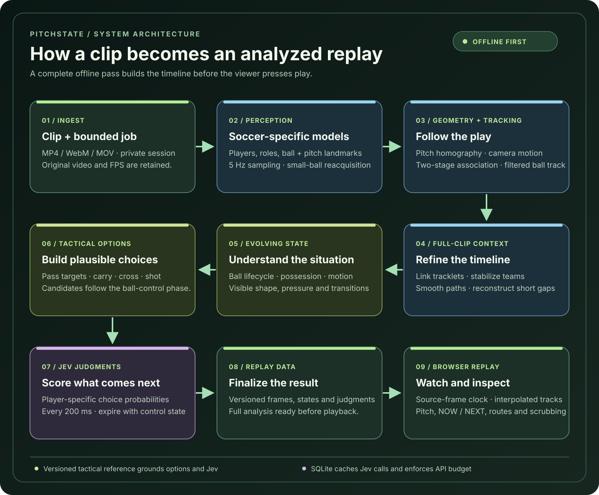

# PitchState

### See the game beneath the game.

PitchState turns a short soccer clip into an interactive match analysis. It follows players and the ball, reconstructs their positions on a pitch, tracks how possession and team shape change, and shows the most likely **next decision** as the play unfolds. The result is processed before playback, so viewers can scrub through the footage and watch the analysis move with it.

[Watch the demo](#demo) · [Explore the architecture](#architecture) · [Run locally](#run-locally) · [Read the evaluation](docs/VALIDATION.md)

## Demo

https://github.com/user-attachments/assets/8cfa273a-fa0a-43c9-88aa-8f9407f17304

**[Open the 60 FPS replay](docs/assets/pitchstate-demo.mp4)** · 12-second real-footage excerpt · 5 Hz analysis

The overlays are drawn from saved neural tracking and Jev judgments. The 60 FPS replay interpolates those overlays over 25 FPS source footage; it does not invent new camera frames. Numbers are track IDs, not recognized jersey numbers. [Footage and demo details](docs/assets/README.md).

## Architecture



Three soccer-trained models detect players, the ball, and pitch landmarks. Camera geometry and full-clip refinement stabilize the tracks before the system builds possession, tactical evidence, and player-specific action choices. Jev scores those choices every 200 ms; predictions expire when control changes. The browser then replays the completed result at the source video's cadence, including 60 FPS clips.

The [architecture notes](docs/ARCHITECTURE.md) cover the algorithms and data flow; the [tactical reference](docs/TACTICAL_REFERENCE.md) and [Jev integration](docs/JEV.md) document how the predictions are grounded and bounded.

## Run locally

Requires Node 22 and Python 3.10+. Model downloads total about 414 MB. The tested environment is macOS with Apple MPS; CUDA and CPU are also selectable.

```sh
npm ci
bash scripts/setup_backend.sh
cp .env.example .env.local
# Add JEV_API_KEY to .env.local for predictions.
npm run server
```

In another terminal:

```sh
npm run dev
```

Open http://127.0.0.1:5173 and upload an MP4, WebM, or MOV of up to 60 seconds and 100 MB. Select the darker team's attack direction, then wait for the analysis to complete. Replay, scrub, inspect tracks and tactical moments, or export the analysis JSON. Without a Jev key, tracking and game-state analysis still run; predictions are shown as unavailable.

## Evaluation and limits

The real-footage tests use two clips from [Roboflow's soccer example](https://github.com/roboflow/sports/tree/main/examples/soccer). Full clips and model weights are downloaded separately. To reproduce an analysis:

```sh
.venv/bin/python scripts/download_assets.py --footage
PYTHONPATH=. .venv/bin/python scripts/analyze_clip.py data/2e57b9_0.mp4 \
  --seconds 12 --jev --output .local/real-analysis.json
```

The 12-second and 8-second development clips produced 60 and 40 analysis samples respectively, with observed ball coverage of 86.7% and 92.5%. Coverage is availability, not tracking accuracy. See the [validation notes](docs/VALIDATION.md) and [machine-readable results](reports/real-footage-baseline.json).

PitchState is an engineering research project, not a validated professional tracking system. Occlusion, airborne balls, similar kits, crowded scenes, and partial-field views can affect IDs, positions, and tactical judgments. Jev probabilities have not been calibrated against labeled match outcomes. Full-clip refinement uses later observations, so the displayed forecasts are retrospective judgments rather than a prospective prediction benchmark.

## Engineering notes

The FastAPI service processes one bounded job at a time, keeps uploads private to their session, and uses persistent neural and Jev caches. SQLite tracks Jev requests and spending limits. Raw video is not sent to Jev. The replay uses `requestVideoFrameCallback` and interpolates between analysis samples; 60 FPS playback depends on the uploaded video and browser capacity.

For backend tests, install `server/requirements-test.txt` in the backend environment. Run checks with `npm test`, `npm run build`, `npm run format:check`, `npm run test:server`, and `.venv/bin/ruff check server scripts`. See [deployment](docs/DEPLOYMENT.md) for the single-worker setup and its limits. Public deployment also requires review of model licenses and footage rights in [the asset manifest](models/manifest.json).
